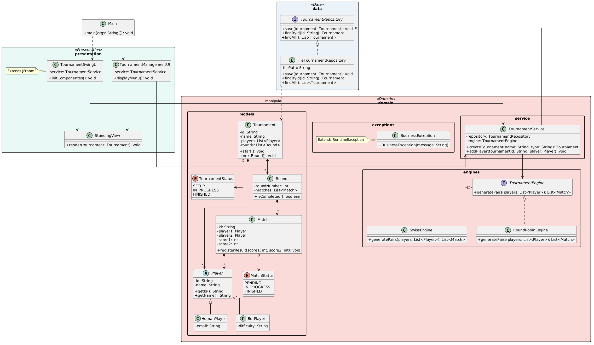

# Play Setup - Sistema de Gerenciamento de Torneios

Trabalho prático desenvolvido para a disciplina de **Linguagem de Programação II** no curso de Tecnologia da Informação da **UFRN**. O sistema visa gerenciar a execução de torneios de jogos (como xadrez, e-sports ou card games) utilizando diferentes motores de emparelhamento.

## 🚀 Funcionalidades
- Cadastro de Torneios, Jogadores (Humanos e Bots) e Partidas.
- Suporte a múltiplos motores de torneio: **Suíço (Swiss)** e **Todos contra Todos (Round Robin)**.
- Persistência de dados local em arquivos de texto.
- Interface dupla: Console (CLI) e Interface Gráfica (Swing).

## 🛠️ Arquitetura do Projeto

O projeto adota uma arquitetura em camadas bem definidas para isolar responsabilidades e facilitar a manutenção do código:

- **`presentation`**: Camada responsável pela interação com o usuário (CLI e GUI Swing).
- **`domain`**: O núcleo do negócio contendo as entidades (`models`), regras de emparelhamento (`engines`), validações (`exceptions`) e os fluxos principais (`service`).
- **`data`**: Camada de persistência responsável pelo armazenamento e recuperação dos dados dos torneios.

---

## 📊 Diagrama de Classes UML

O diagrama abaixo ilustra a separação das camadas do projeto, os atributos principais, métodos e os respectivos relacionamentos.



## 🔧 Como Executar o Projeto

Certifique-se de ter o Java JDK instalado (versão 17 ou superior recomendada).

Compile as classes do projeto:

```bash
javac org/play/Main.java
```

Execute a aplicação:

```bash
java org.play.Main
```
